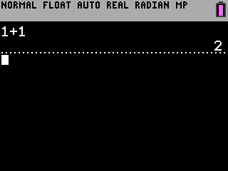

# Always-on Dark Mode 

This program works similar to other dark mode programs for the TI-84 Plus CE, with the exception that it will maintain dark mode even after turning the calculator off and back on again.

---

### Installation

1. Download the [latest release](https://github.com/TIny-Hacker/always-dark/releases/latest) and send **DARKINST.8xp** and **DarkHook.8xv** to your calculator.
2. Ensure that **DarkHook.8xv** is in the archive.

---

### Usage

To enable dark mode, all you need to do is run **prgmDARKINST** from the OS programs menu. Keep in mind that shells (like Cesium) will interfere with this program, as they use their own hooks which conflict with Always Dark. If for whatever reason you reset your calculator, you'll need to run **prgmDARKINST** again to re-enable dark mode. If your calculator is in dark mode and you'd like to disable it, you can follow the same procedure by simply running **prgmDARKINST** and your calculator will be back to normal again.

---

### Credits

I'd like to give a massive thanks to [RoccoLox Programs](https://github.com/roccoloxprograms/) for being a huge help on this project and writing a lot of the assembly code. Be sure to check out his projects as well!
